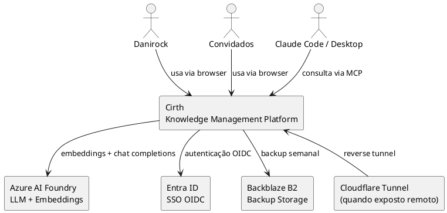
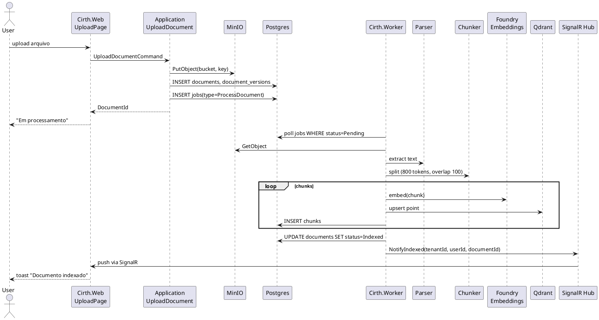
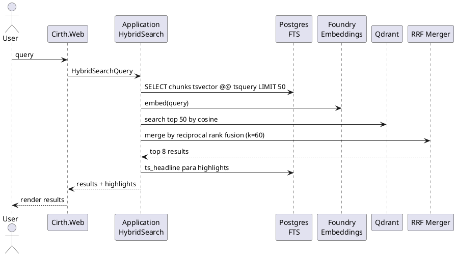
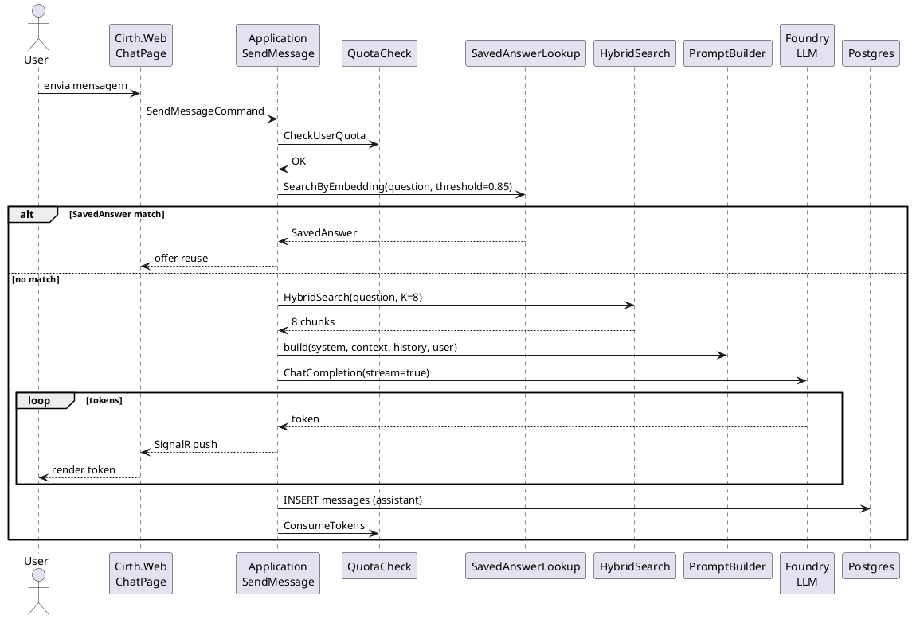
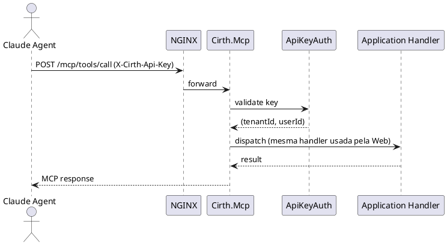
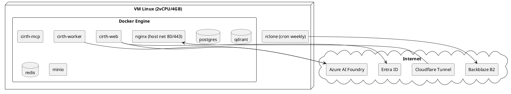

# Cirth — Arquitetura

Documento técnico de arquitetura: diagramas C4 em PlantUML (readable, sem legenda/cores/protocolos — você gera a parte visual no draw.io reaproveitando o padrão visual TP), fluxos críticos em sequence diagrams, e notas de decisão.

---

## 1. C4 Context



## 2. C4 Container

```plantuml
@startuml C2_Container

actor User
actor "Claude Agent" as Agent

rectangle "Cirth Platform" {
  
  Container_Boundary(edge, "Edge") {
    rectangle "NGINX\n+ ModSecurity (OWASP CRS)" as NGINX
  }
  
  Container_Boundary(app, "Application") {
    rectangle "Cirth.Web\nBlazor Server\n.NET 10" as Web
    rectangle "Cirth.Mcp\nMCP Server\n.NET 10" as Mcp
    rectangle "Cirth.Worker\nBackgroundService\n.NET 10" as Worker
  }
  
  Container_Boundary(data, "Data") {
    database "PostgreSQL 16\nMetadata + FTS\n+ Job Queue" as Postgres
    database "Qdrant\nVector Embeddings" as Qdrant
    database "Redis 7\nCache + Sessions" as Redis
    rectangle "MinIO\nS3-compatible\nObject Storage" as Minio
  }
}

rectangle "Azure AI Foundry" as Foundry
rectangle "Entra ID" as EntraID

User --> NGINX
Agent --> NGINX
NGINX --> Web
NGINX --> Mcp

Web --> Postgres
Web --> Qdrant
Web --> Redis
Web --> Minio
Web --> Foundry
Web --> EntraID

Mcp --> Postgres
Mcp --> Qdrant
Mcp --> Redis
Mcp --> Foundry

Worker --> Postgres
Worker --> Qdrant
Worker --> Minio
Worker --> Foundry

@enduml
```

## 3. C4 Component — Cirth.Application

```plantuml
@startuml C3_Application_Components

rectangle "Cirth.Application" {
  
  Container_Boundary(features, "Features (Use Cases)") {
    rectangle "Documents\n- UploadDocument\n- GetDocument\n- ListDocuments\n- DeleteDocument\n- RestoreDocumentVersion" as DocsFeat
    rectangle "Search\n- HybridSearch\n- FilteredSearch" as SearchFeat
    rectangle "Chat\n- StartConversation\n- SendMessage (streaming)\n- ListConversations\n- RegenerateMessage" as ChatFeat
    rectangle "SavedAnswers\n- SaveAnswer\n- SearchSavedAnswers\n- RateSavedAnswer" as SavedFeat
    rectangle "Tags\n- CreateTag\n- AssignTags\n- SuggestTags (AI)" as TagsFeat
    rectangle "Collections\n- CreateCollection\n- AddToCollection" as CollFeat
    rectangle "Identity\n- ProvisionUserOnLogin\n- InviteUser\n- ManageRoles\n- GenerateApiKey" as IdentFeat
    rectangle "Quotas\n- CheckQuota\n- ConsumeQuota\n- ResetDaily" as QuotaFeat
  }
  
  Container_Boundary(ports, "Ports (Interfaces)") {
    rectangle "IDocumentParser\nIChunker\nIEmbeddingService\nIVectorStore\nIObjectStorage\nILlmChatService\nIJobQueue\nIApiKeyHasher" as Ports
  }
  
  Container_Boundary(pipeline, "Pipeline Behaviors") {
    rectangle "LoggingBehavior\nValidationBehavior\nTenantScopingBehavior\nQuotaBehavior" as Pipeline
  }
}

DocsFeat ..> Ports
SearchFeat ..> Ports
ChatFeat ..> Ports
SavedFeat ..> Ports
TagsFeat ..> Ports

@enduml
```

## 4. Fluxo: Ingestão de documento



## 5. Fluxo: Busca híbrida



## 6. Fluxo: Chat RAG com streaming



## 7. Fluxo: MCP server respondendo



## 8. Decisões arquiteturais importantes

Consulte `docs/adr/` para o histórico completo. Resumo:

- **ADR-001**: Modular monolith em Clean Architecture, não microsserviços.
- **ADR-002**: Blazor Server como frontend único, sem SPA externa.
- **ADR-003**: Busca híbrida BM25 + vetorial via RRF, sem reranker na V1.
- **ADR-004**: MinIO como object storage S3-compatible desde o início.
- **ADR-005**: Multi-tenant lógico via TenantId + global query filter desde a V1.
- **ADR-006**: MCP server reusa Application handlers (mesma lógica que UI).

## 9. Topologia de deploy (V1)



## 10. Estrutura de rede Docker

- Network `cirth-edge`: nginx + web + mcp
- Network `cirth-data`: web + mcp + worker + postgres + qdrant + redis + minio
- Network `cirth-internal`: web + worker (jobs hub)

NGINX é o único container exposto ao host.
