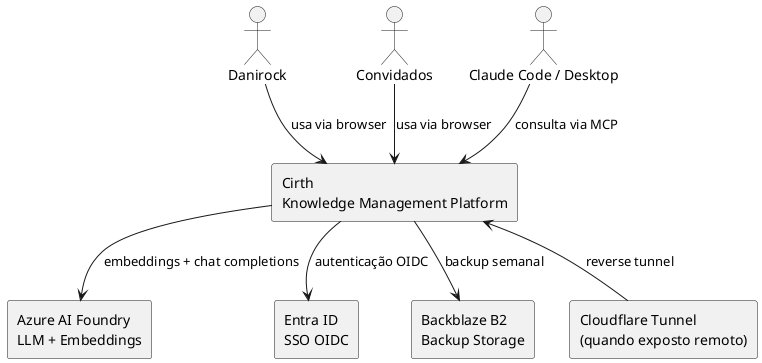
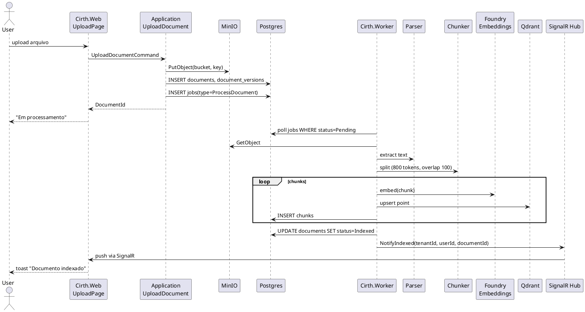
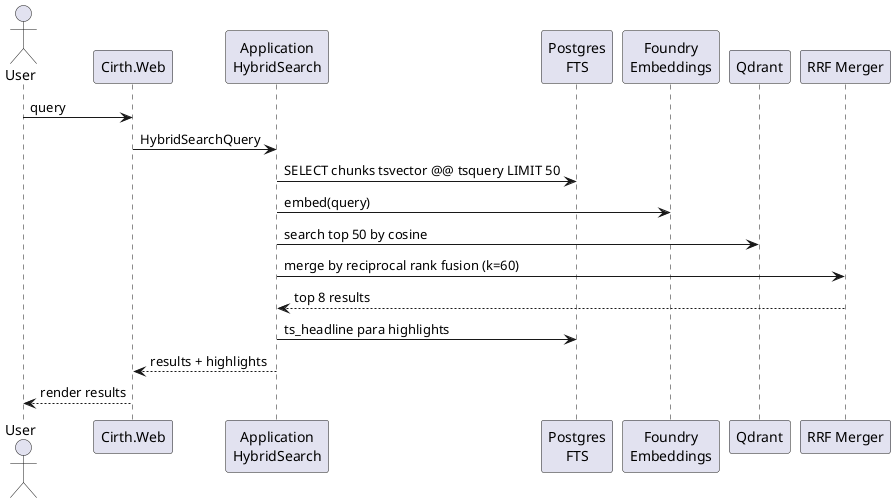
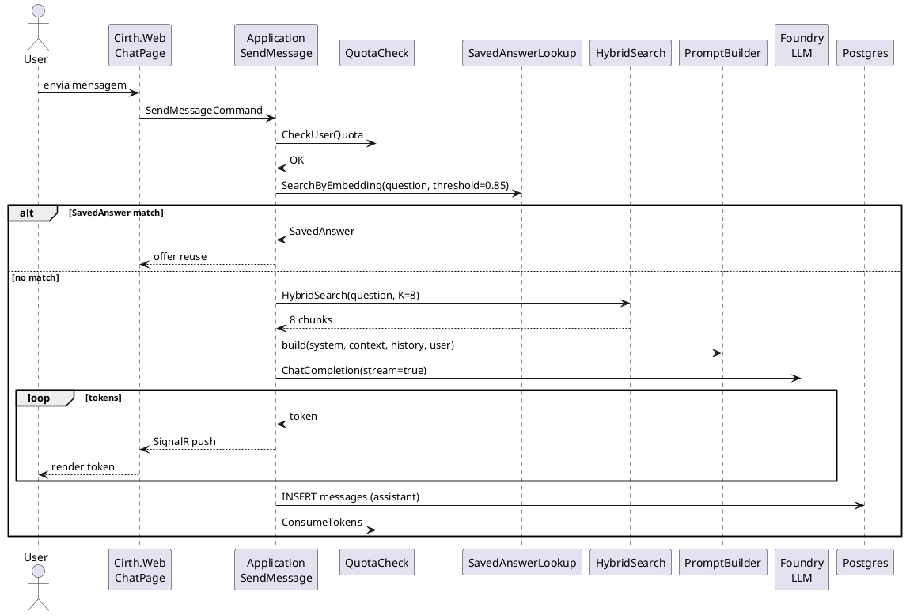
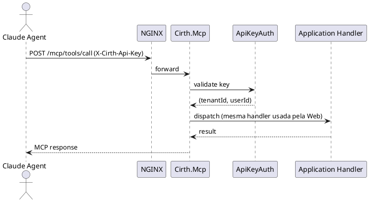
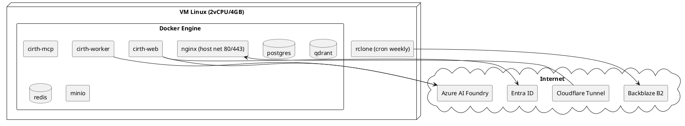

# Cirth — Arquitetura

Documento técnico de arquitetura: diagramas C4 em PlantUML (readable, sem legenda/cores/protocolos — você gera a parte visual no draw.io reaproveitando o padrão visual TP), fluxos críticos em sequence diagrams, e notas de decisão.

---

## 1. C4 Context



## 2. C4 Container

```plantuml
@startuml C2_Container

actor User
actor "Claude Agent" as Agent

rectangle "Cirth Platform" {
  
  Container_Boundary(edge, "Edge") {
    rectangle "NGINX\n+ ModSecurity (OWASP CRS)" as NGINX
  }
  
  Container_Boundary(app, "Application") {
    rectangle "Cirth.Web\nBlazor Server\n.NET 10" as Web
    rectangle "Cirth.Mcp\nMCP Server\n.NET 10" as Mcp
    rectangle "Cirth.Worker\nBackgroundService\n.NET 10" as Worker
  }
  
  Container_Boundary(data, "Data") {
    database "PostgreSQL 16\nMetadata + FTS\n+ Job Queue" as Postgres
    database "Qdrant\nVector Embeddings" as Qdrant
    database "Redis 7\nCache + Sessions" as Redis
    rectangle "MinIO\nS3-compatible\nObject Storage" as Minio
  }
}

rectangle "Azure AI Foundry" as Foundry
rectangle "Entra ID" as EntraID

User --> NGINX
Agent --> NGINX
NGINX --> Web
NGINX --> Mcp

Web --> Postgres
Web --> Qdrant
Web --> Redis
Web --> Minio
Web --> Foundry
Web --> EntraID

Mcp --> Postgres
Mcp --> Qdrant
Mcp --> Redis
Mcp --> Foundry

Worker --> Postgres
Worker --> Qdrant
Worker --> Minio
Worker --> Foundry

@enduml
```

## 3. C4 Component — Cirth.Application

```plantuml
@startuml C3_Application_Components

rectangle "Cirth.Application" {
  
  Container_Boundary(features, "Features (Use Cases)") {
    rectangle "Documents\n- UploadDocument\n- GetDocument\n- ListDocuments\n- DeleteDocument\n- RestoreDocumentVersion" as DocsFeat
    rectangle "Search\n- HybridSearch\n- FilteredSearch" as SearchFeat
    rectangle "Chat\n- StartConversation\n- SendMessage (streaming)\n- ListConversations\n- RegenerateMessage" as ChatFeat
    rectangle "SavedAnswers\n- SaveAnswer\n- SearchSavedAnswers\n- RateSavedAnswer" as SavedFeat
    rectangle "Tags\n- CreateTag\n- AssignTags\n- SuggestTags (AI)" as TagsFeat
    rectangle "Collections\n- CreateCollection\n- AddToCollection" as CollFeat
    rectangle "Identity\n- ProvisionUserOnLogin\n- InviteUser\n- ManageRoles\n- GenerateApiKey" as IdentFeat
    rectangle "Quotas\n- CheckQuota\n- ConsumeQuota\n- ResetDaily" as QuotaFeat
  }
  
  Container_Boundary(ports, "Ports (Interfaces)") {
    rectangle "IDocumentParser\nIChunker\nIEmbeddingService\nIVectorStore\nIObjectStorage\nILlmChatService\nIJobQueue\nIApiKeyHasher" as Ports
  }
  
  Container_Boundary(pipeline, "Pipeline Behaviors") {
    rectangle "LoggingBehavior\nValidationBehavior\nTenantScopingBehavior\nQuotaBehavior" as Pipeline
  }
}

DocsFeat ..> Ports
SearchFeat ..> Ports
ChatFeat ..> Ports
SavedFeat ..> Ports
TagsFeat ..> Ports

@enduml
```

## 4. Fluxo: Ingestão de documento



## 5. Fluxo: Busca híbrida



## 6. Fluxo: Chat RAG com streaming



## 7. Fluxo: MCP server respondendo



## 8. Decisões arquiteturais importantes

Consulte `docs/adr/` para o histórico completo. Resumo:

- **ADR-001**: Modular monolith em Clean Architecture, não microsserviços.
- **ADR-002**: Blazor Server como frontend único, sem SPA externa.
- **ADR-003**: Busca híbrida BM25 + vetorial via RRF, sem reranker na V1.
- **ADR-004**: MinIO como object storage S3-compatible desde o início.
- **ADR-005**: Multi-tenant lógico via TenantId + global query filter desde a V1.
- **ADR-006**: MCP server reusa Application handlers (mesma lógica que UI).

## 9. Notas de implementação relevantes

### Upload de arquivos (Blazor Server)
`IBrowserFile.OpenReadStream()` retorna um stream não-seekable. O `UploadDocumentCommandHandler` copia o conteúdo para um `MemoryStream` antes de calcular o hash SHA-256 e enviar ao MinIO. Limite de 50 MB por upload.

`MinioObjectStorage` usa `content.CanSeek ? content.Length : -1` em `.WithObjectSize()` — passar `-1` instrui o SDK a usar transferência em chunks, evitando `NotSupportedException` com streams não-seekable.

### IJobQueue: serialização do payload
`IJobQueue.EnqueueAsync(string type, object payload)` serializa o payload internamente via `JsonSerializer.Serialize`. Nunca pré-serialize o objeto antes de passar — isso resulta em dupla serialização (string JSON dentro de string JSON) que quebra a deserialização no Worker. Sempre passe o objeto diretamente:

```csharp
// CORRETO
await jobQueue.EnqueueAsync("ProcessDocument", new ProcessDocumentPayload(...), ct);

// ERRADO — causa string-in-string no banco
await jobQueue.EnqueueAsync("ProcessDocument", JsonSerializer.Serialize(payload), ct);
```

### ISystemHealthService (observabilidade de infraestrutura)
`ISystemHealthService` é uma porta definida em `Cirth.Application.Common.Ports` e implementada por `SystemHealthService` em `Cirth.Infrastructure.Health`. Verifica PostgreSQL, Redis, Qdrant, MinIO e Azure AI Foundry, retornando `ServiceHealthStatus` (nome, saúde, detalhe, latência em ms) para cada serviço.

Acessível via `GetSystemStatusQuery` (MediatR) na tela **Administração → Conexões** (apenas para `Admin`).

### Antiforgery + HTMX
Razor Pages valida antiforgery em **todo POST** por padrão. Sem token válido, a request volta `400 Bad Request` antes mesmo de o handler rodar — sintoma típico: clica em "Criar tag" e nada acontece.

Forms `<form method="post">` recebem `__RequestVerificationToken` automaticamente do tag helper, mas dois cenários quebram esse caminho:
1. **HTMX POSTs avulsos** (em `<span>`, `<button>` sem form) — não tem campo escondido nenhum.
2. **Forms sem `asp-*`** (puramente HTMX) — o tag helper só dispara com pelo menos um `asp-` attribute em algumas versões; com `method="post"` puro funciona, mas é confiar em comportamento sutil.

Solução adotada: renderizar o token no `<body hx-headers='{"RequestVerificationToken":"..."}'>` do `_Layout`. HTMX herda esses headers em toda request `hx-*`, então o antiforgery middleware sempre acha o header correto (mesmo em POSTs sem `<form>`). O cookie de antiforgery vem na primeira GET pra qualquer página do app.

Código (em `Pages/Shared/_Layout.cshtml`):
```csharp
@inject Microsoft.AspNetCore.Antiforgery.IAntiforgery Antiforgery
@{
    var antiforgeryToken = Antiforgery.GetAndStoreTokens(HttpCtx.HttpContext!).RequestToken;
    var hxHeaders = JsonSerializer.Serialize(new Dictionary<string,string> { ["RequestVerificationToken"] = antiforgeryToken ?? "" });
}
<body hx-headers='@hxHeaders'>
```

### Azure AI Foundry — chat e embedding em endpoints diferentes
A Foundry serve chat e embedding por hosts distintos com path/SDK incompatíveis:

- **Chat** (`https://<resource>.openai.azure.com/openai/v1/chat/completions`): Responses API nova. Usa `OpenAI.Chat.ChatClient` direto com endpoint override (`AzureOpenAIClient` gera o path antigo e bate 404 DeploymentNotFound).
- **Embedding** (`https://<resource>.cognitiveservices.azure.com/openai/deployments/{name}/embeddings`): endpoint legacy. Usa `AzureOpenAIClient.GetEmbeddingClient(name)` normalmente.

DI em `Cirth.Infrastructure/DependencyInjection.cs`:

```csharp
// Chat — OpenAI SDK puro com endpoint override
services.AddSingleton<IChatClient>(_ =>
    new OpenAI.Chat.ChatClient(
        model: configuration["AzureAi:Chat:Deployment"],
        credential: new ApiKeyCredential(configuration["AzureAi:Chat:ApiKey"]),
        options: new OpenAIClientOptions { Endpoint = new Uri(configuration["AzureAi:Chat:Endpoint"]) })
    .AsIChatClient());

// Embedding — Azure.AI.OpenAI normal
services.AddSingleton<IEmbeddingGenerator<string, Embedding<float>>>(_ =>
    new AzureOpenAIClient(new Uri(configuration["AzureAi:Embedding:Endpoint"]), new AzureKeyCredential(...))
        .GetEmbeddingClient(configuration["AzureAi:Embedding:Deployment"])
        .AsIEmbeddingGenerator());
```

### Health probes da IA — não-persistentes
`CheckChatAsync` e `CheckEmbeddingAsync` no `SystemHealthService` chamam a IA real (sem mocks) com payloads mínimos:
- Chat: `GetResponseAsync([new(User, "ok")], { MaxOutputTokens = 1 })` — 1 token in/out, ~ ms de custo.
- Embedding: `GenerateAsync(["ok"])` — single embedding.

Resultados não são persistidos em DB, não passam por quotas, não geram side effects. Servem só pra confirmar que o deployment existe e a chave é válida. Timeout de 15s (chat) e 5s (resto).

### Fila de jobs — recovery automático + retry manual

**Modelo** (em `Cirth.Domain.Jobs.IngestionJob`): estados `Pending → Processing → Completed | Retrying → ... | Failed`. `Fail(error)` faz backoff exponencial (30s, 2min, 8min) até `MaxAttempts=3`, depois cai em `Failed` permanente.

**Recovery automático** (`StuckJobRecoveryService` no Worker): a cada 2 min varre jobs em `Processing` com `updated_at < now - 10min` (worker crashou no meio) e move pra `Retrying` (ou `Failed` se já tinha atingido MaxAttempts). Configurável via `Worker:StuckJobScanIntervalSeconds` e `Worker:StuckJobThresholdMinutes`.

**Retry manual** (`RetryFailedJobsCommand` na Application, exposto no `/Admin` → tab Conexões → botão "Reprocessar falhas"): zera `attempts` e move tudo em `Failed` pra `Pending`. Usar depois que uma falha de infra (ex.: IA fora do ar) for resolvida.

Implementação raw-SQL em `PostgresJobQueue.RecoverStuckJobsAsync` e `RetryFailedJobsAsync` — bypassa filtro de tenant intencionalmente (operação global). Sem mensageria nem DLQ separada; Postgres é o broker.

### Health checks — armadilhas conhecidas
`SystemHealthService` (em `Cirth.Infrastructure/Health/`) chama infraestrutura real. Duas pegadinhas que já mordemos:

1. **EF `SqlQueryRaw<string>` exige coluna `Value`**: `db.Database.SqlQueryRaw<string>("SELECT version()")` falha com `42703 column s.Value does not exist` porque o provider envelopa a query num `SELECT s."Value" FROM (...) AS s`. Sempre aliase: `SELECT version() AS "Value"`.

2. **`InfoAsync` no StackExchange.Redis é admin-only**: chamar `redis.GetServer(...).InfoAsync()` exige `allowAdmin=true` na connection string, o que aumenta a superfície de permissões além do necessário para o app. Use só `PingAsync` — confirma que o servidor responde sem precisar de admin. A versão fica oculta.

### Frontend: Razor Pages + HTMX
A V1 começou em Blazor Server e foi migrada para Razor Pages + HTMX por dois motivos: (1) o circuito SignalR do Blazor é frágil — qualquer exceção não-tratada em event handler derruba a página inteira; (2) state-in-memory dentro de componentes Razor era difícil de raciocinar e gerava bugs de re-render. Razor Pages devolve renderização server-side determinística; HTMX cobre os 10% de interatividade dinâmica (partial swaps, debounced filters, SSE de chat) sem custo de SPA.

**Estrutura**:
- `Pages/Index.cshtml` (`/`) — landing pública
- `Pages/Documents/{Index, Upload, Detail}.cshtml` — list/form/view
- `Pages/Chat/{Index, Stream}.cshtml` — chat layout + endpoint SSE para streaming
- `Pages/Admin/Index.cshtml` — tabs profile/conexões via `data-tabs` + `htmx.ajax` lazy-load
- `Pages/{Tags, Collections, Saved, Search, ApiKeys}/Index.cshtml`
- `Pages/Error.cshtml` — error page (`UseStatusCodePagesWithReExecute("/Error/{0}")`)

**Base PageModel** (`Cirth.Web.Infrastructure.CirthPageModel`): herança comum com `Toast`, `SendAsync`, `HxRedirect`, `IsHtmx`. Toast funciona dual: em HTMX vai como header `HX-Trigger: {"toast":...}` (consumido pelo `cirth.js`); em navegação normal vai por `TempData` e o `_Layout` renderiza ao carregar.

**Chat streaming via SSE**: `SendMessageCommand` retorna `IAsyncEnumerable<string>`. POST `/Chat/{id}?handler=Send` cacheia o `PendingChatStream` em `IMemoryCache` (chave = streamId), retorna HTML com user-bubble + assistant-bubble vazia configurada como `<div hx-ext="sse" sse-connect="/Chat/Stream/{streamId}" sse-swap="token" hx-swap="beforeend" sse-close="done">`. O GET `/Chat/Stream/{id}` lê do cache, roda o command, emite eventos `token` (escapados HTML) e fecha com `done`. Cliente HTMX appenda cada token na bubble.

**Auth**: `FallbackPolicy = DefaultPolicy` exige login para tudo, exceto rotas marcadas com `AllowAnonymousToPage("/Index")`, `AllowAnonymousToFolder("/Account")`, e `MapHealthChecks/MapMetrics().AllowAnonymous()`.

**Tratamento de exceções**: o middleware `UseExceptionHandler("/Error")` + `UseStatusCodePagesWithReExecute("/Error/{0}")` cobre exceções globais. PageModels usam `SendAsync<T>` que converte exceções em toast e retorna null. Não-tratadas chegam na página de erro estilizada Cirth.

### CirthHub (SignalR)
`Cirth.Infrastructure.Auth.CirthHub` é o hub canônico — contém a lógica de grupos por `userId`. O Web apenas mapeia `app.MapHub<CirthHub>("/hubs/cirth")`. Não existe hub duplicado em `Cirth.Web`.

`INotificationHub` é registrado como `SignalRNotificationHub` no Web (via `AddSignalRNotifications()`), e como `NullNotificationHub` no Worker (padrão do `AddInfrastructure()`).

### Worker: contexto de tenant
`TenantScopingBehavior` requer `ITenantProvider` para todo comando MediatR. O Worker registra `WorkerTenantProvider` (implementação scoped sem HTTP context) e cada job scope chama `workerTenant.Set(tenantId, userId)` com os valores do payload do job antes de despachar qualquer comando via MediatR.

### Repositórios assíncronos
Todos os métodos de repositório retornam `IReadOnlyList<T>` usando `async/await` puro — `ContinueWith` foi removido porque bloqueia a thread pool via `.Result`.

## 9. Topologia de deploy (V1)



## 10. Estrutura de rede Docker

- Network `cirth-edge`: nginx + web + mcp
- Network `cirth-data`: web + mcp + worker + postgres + qdrant + redis + minio
- Network `cirth-internal`: web + worker (jobs hub)

NGINX é o único container exposto ao host.
